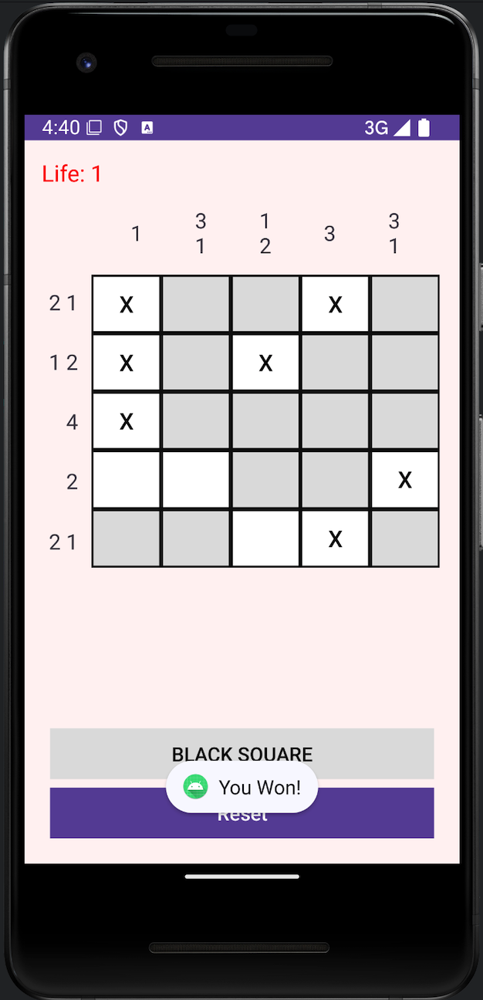

# NonoGram

Making NonoGram for Mobile Programming Project

---

## Preview

|  |  |
| --------------------------- | --------------------------- |
|  |  |

---

## Features (주요 기능)

- **Dynamic Grid Layout (동적 그리드 레이아웃)**: 8x8 크기의 동적 그리드 UI 생성
- **Cell Class (셀 클래스)**: 각 칸의 상태(검은 칸, "X" 표시 등)를 관리
- **Game Control (게임 제어)**: 목숨 시스템과 게임 종료 조건 구현
- **Toggle Functionality (토글 기능)**: 검은 칸 찾기와 "X" 표시 전환 가능

---

## How to Build (빌드 방법)

1. 새로운 프로젝트 생성

   - **프로젝트 이름:** `Nonograms`
   - **패키지 이름:** `com.example.nonograms`

2. `TableLayout`을 활용해 8x8 크기의 동적 UI를 프로그래밍 방식으로 구현.

   - `TableRows`, `TextViews`, `Buttons` 추가

3. `Cell` 클래스를 구현해 각 칸의 상태와 이벤트를 관리.
